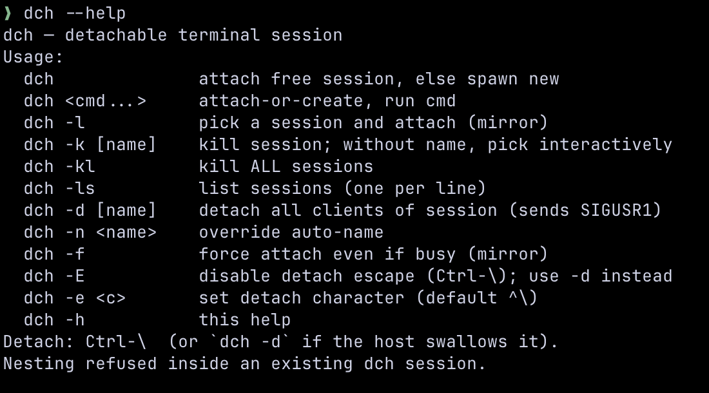

# dch — detachable terminal sessions, the simple way

A tiny terminal multiplexer built on top of [dtach][dtach]. No windows, no
panes, no tabs, no config file. One session per project, auto-named, attached
on demand. Close the laptop, drop the SSH, quit the terminal — your shell
keeps running.

The name is short for **ditch** — ditch your terminal, keep the session.



[dtach]: https://github.com/crigler/dtach

---

## What it is

`dch` wraps a small fork of `dtach` into one statically-built C binary. It
gives you the **one** thing screen/tmux/zellij are useful for — surviving
disconnect — and nothing else:

- **No windows / panes / tabs.** If you want those, use tmux.
- **One session per project.** Auto-named `<repo>-<branch>` when run from a
  git worktree, otherwise the directory basename.
- **Attach is idempotent.** Run `dch` again from the same dir — it reattaches
  the existing session instead of starting a duplicate.
- **Survives client death.** The master daemon is split from the client, so
  killing the terminal window (crash, GUI quit, SSH drop) leaves the shell
  alive. Open a new window and `dch` reattaches.
- **Agents can drive sessions headlessly.** Each session keeps an in-memory
  terminal mirror (via [libghostty-vt][ghostty]), so scripts and coding
  agents can send keys, read the rendered screen, and wait for output —
  without attaching, without a pty, without disturbing a human who *is*
  attached. See [Agent API](#agent-api).
- **No config file, no shell hooks.** One binary on `$PATH`.

[ghostty]: https://github.com/ghostty-org/ghostty

## Examples

The two forms you'll use 90% of the time are bare `dch` and `dch <cmd>` —
both auto-name the session from the current directory.

```sh
cd ~/code/coolapp              # git repo, currently on branch "feat-auth"
dch claude                     # → session "coolapp-feat-auth" if absent;
                               #   then runs claude inside the session

# new terminal, or after detach:
git checkout master
dch                            # → DIFFERENT session: "coolapp-master" (branch is part of the name)

# new terminal, or after detach:
cd /tmp/scratch                # not a git repo
dch                            # → session "scratch", starts default shell

dch -n release zsh             # → override auto-name; session "release"
dch -ls                        # → list every running session
dch -l                         # → pick one (TUI, arrow keys) and attach
dch -rl                        # → pick one, type a new display name, repeat
dch -k                         # → pick one and kill it
dch -kl                        # → kill ALL sessions
```

The auto-name uses cwd basename when you're not in a git repo, and
`<repo-toplevel>-<branch>` when you are — slashes in branch names get
replaced with `_` so they're safe.

`dch -rl` renames a session interactively: pick one, type a new display
name, and you're dropped back on the list to rename the next. The new name
is a display **alias** only — stored in a sidecar file next to the socket,
shown with priority in `-l`/`-rl` as `alias (real-name)`. The underlying
session name is untouched, so attach/kill/detach by real name keep working.
An empty input clears the alias; killing a session removes its alias too.

An agent (or plain shell script) can drive a TUI in a session it never
attaches to:

```sh
dch --spawn infra --size 120x40 k9s   # headless session running k9s
dch --wait infra --match "Pods" --timeout 15000   # block until it's up
dch --keys infra :                    # k9s command mode
dch --run infra deployments           # type the view name, press enter
dch --read infra                      # print the rendered screen, no attach
dch --read infra --ansi > snap.txt    # same, with colors
```

## Install with Homebrew

```sh
brew install ventsislav-georgiev/tap/dch        # full: agent API included
brew install ventsislav-georgiev/tap/dch-lite   # ~100 KB, no terminal mirror
```

Two formulas, `conflicts_with` each other — pick one. **dch** embeds
libghostty-vt (~2 MB binary) and supports every verb in the
[Agent API](#agent-api). **dch-lite** is the classic ~100 KB
attach/detach tool: `--send`/`--run`/`--keys` still work (keys via a
legacy encoding), but `--read`/`--wait` need the mirror and exit 3.
The formulas are auto-published to the tap by dch's release workflow on
every `v*` tag.

## Quick install

```sh
git clone https://github.com/ventsislav-georgiev/dch.git
cd dch
./configure               # or: ./configure --without-libghostty  (lite build)
make
mkdir -p ~/.local/bin
install -m 0755 dch ~/.local/bin/dch     # or anywhere on $PATH
```

Make sure `~/.local/bin` is in your `$PATH`, then `dch -h` to confirm.

**Dependencies:** a C compiler (`clang` or `gcc`) and `autoconf`.
- macOS: `xcode-select --install` (clang + make) + `brew install autoconf`.
- Debian/Ubuntu: `sudo apt install build-essential autoconf`.

## Install with an agent

Point any coding agent (Claude Code, Cursor, Aider, …) at this link:

> **[`docs/AGENT_INSTALL.md`](docs/AGENT_INSTALL.md)**

…and say *"install dch by following this file"*. The agent will clone,
build, install to `~/.local/bin`, and verify in one go.

Once installed, agents should read the [Agent API](#agent-api) section —
it's the whole point of giving them dch.

## Cheatsheet

```sh
dch              # attach the auto-named session, or create it
dch <cmd...>     # same, but if new, run <cmd> in it
dch -ls          # list sessions
dch -l           # pick a session (arrow keys) and attach
dch -rl          # rename: pick a session, type a display alias, repeat
dch -k [name]    # kill a session (interactive picker if no name)
dch -kl          # kill ALL sessions
dch -d [name]    # detach all clients of a session (sends SIGUSR1)
dch -n <name>    # override the auto-name
dch -f           # force-attach even if another client is connected

# agent / scripting verbs (never attach; see Agent API)
dch --spawn <name> [--size CxR] [cmd...]        # start a headless session
dch --send <name> <text...>                     # type text into the session
dch --run <name> <text...>                      # type text, press enter
dch --keys <name> <key...>                      # send keys: ctrl+c up f2 ...
dch --read <name> [--ansi] [--recent [N]]       # print the rendered screen
dch --wait <name> --match <str> [--timeout ms]  # block until output matches
dch --ls-json                                   # sessions as a JSON array
```

Inside a session: `Ctrl-\` to detach. Works in vim, fzf, less, Claude Code,
etc. — terminals that swallow most control keys still pass `Ctrl-\` through.

## Agent API

Every dch session keeps an in-memory **terminal mirror**: the master feeds
each pty byte into an embedded [libghostty-vt][ghostty] terminal (Ghostty's
VT engine as a C library, no rendering). The mirror is what `--read` prints
and `--wait` scans, and it tracks the modes (kitty keyboard protocol,
application cursor keys) that `--keys` uses to encode keys exactly the way
the running app expects.

Control verbs use a dedicated connection type: they never attach, never
allocate a pty, and never echo to attached humans. Reading a session that
someone is watching is invisible to them.

### Verbs

| Verb | Does | Exit codes |
| --- | --- | --- |
| `--spawn <n> [--size CxR] [cmd...]` | Start headless session (default: `$SHELL`, 80x24 or `$COLUMNS`/`$LINES`). Prints the name. | 0 ok, 1 exists/failed |
| `--send <n> <text...>` | Type text (joined with spaces), no enter. | 0 ok |
| `--run <n> <text...>` | `--send` + enter. | 0 ok |
| `--keys <n> <key...>` | Encode+send keys mode-aware: `ctrl+c`, `alt+x`, `shift+tab`, `up`, `f5`, `enter`, `esc`, single chars. | 0 ok, 1 unknown key |
| `--read <n> [--ansi] [--recent [N]]` | Print rendered screen. `--ansi` keeps colors; `--recent [N]` = last N lines incl. scrollback (default 100). | 0 ok, 1 error, 3 no mirror |
| `--wait <n> --match <str> [--timeout ms]` | Block until screen/scrollback contains `<str>` (literal substring, ≤512 bytes); prints the matching line. Default timeout 10 s. | 0 hit, 2 timeout, 3 no mirror |
| `--ls-json` | All sessions as JSON: `[{"name","alias","activity_epoch"}]`. | 0 |

A typical agent loop:

```sh
dch --spawn build --size 120x40
dch --run build "make -j8 2>&1 | tee build.log"
if dch --wait build --match "error:" --timeout 300000; then
    dch --read build --recent 40      # grab context around the failure
fi
```

### Honest caveats

- **The mirror is a model, not a screenshot.** libghostty-vt implements the
  same VT emulation Ghostty ships, so it's accurate for real-world TUIs
  (vim, k9s, htop, fzf) — but an app probing exotic terminal features could
  in principle render differently on the mirror than on your terminal.
- **`--wait` matches rendered text**, post-VT-processing: a spinner that
  redraws in place produces one line, not hundreds.
- **Timing is yours to handle.** `--send` types instantly; TUIs that debounce
  input may need a `--wait` between verbs, exactly like a human pausing.

### dch-lite and `DCH_NO_VT`

The mirror can be absent: the **dch-lite** build (`./configure
--without-libghostty`) omits it, and `DCH_NO_VT=1` in the master's
environment disables it at spawn.

| Verb | Without mirror |
| --- | --- |
| `--spawn`, `--send`, `--run`, `--ls-json` | Work unchanged (plain pty writes). |
| `--read`, `--wait` | Exit 3 with a message pointing at the full build. |
| `--keys` | Falls back to a fixed legacy xterm table client-side (exit 0 + stderr note). Mode-aware apps may misread modified keys. |

The client side is protocol-only in both builds: a lite `dch` binary can
drive every verb against a session spawned by a full `dch` master.

## How it differs from upstream dtach

This fork (the `dch.c` entry point + small `attach.c` / `master.c` patches)
adds:

- Auto-named sessions (`<repo>-<branch>` or cwd basename), parsed natively
  from `.git/HEAD` — no `git` fork/exec.
- Static-TUI session picker for `-l` / `-k` / `-d` (no external dep like
  `gum` or `fzf`).
- Server/client split so the daemon survives the client closing.
- Per-client PID files for orphan reaping (PPID=1, no controlling TTY).
- Whole-buffer scan for the detach char and `VSUSP` — fixes upstream bug
  where bursty/pasted input could swallow the keypress.
- 16 KB replay buffer (upstream is 4 KB).
- Terminal restore on exit clears mouse-tracking / bracketed-paste /
  alt-screen state that inner apps (vim, fzf) leave on.
- An in-master terminal mirror (embedded libghostty-vt) plus an agent
  control protocol: `--spawn`, `--send`, `--run`, `--keys`, `--read`,
  `--wait`, `--ls-json` — drive and observe TUI sessions without attaching.

## License

GPLv2 (inherited from dtach). See `COPYING`.
